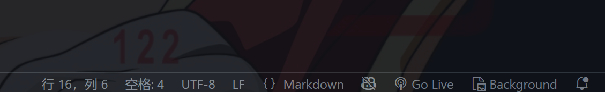

# Medical Insurance Example System

## TechStack
<ul>
    <li>Java: Openjdk-?? </li>
    <li>SQL: MySQL-8.0.42 </li>
</ul>

## Getting Started

## TODO

### 前端

每增加一个新页面，就复制 ``index.html`` 到pages目录下，更改左侧栏目，删掉头两个 ``class="row"`` 的行，删掉顶栏中的负责主题修改的icon（当然，如果你直接复制写好的部分来修改也行）  
效果查看：

点击go live，然后在浏览器中查看  

#### 药品管理页面：  

- [ ] 左侧栏目修改  
- [ ] 解除数据硬编码  
- [x] 更改数据列表布局  
- [ ] 把药品名改成点击后显示详细信息的超链接

### 后端

#### 数据库相关信息

药品编码：string  
药品名称：string  
药品计量单位：enum(包/袋/盒/瓶/支)  
规格：string  
开始日期：date(YYYY/MM/DD/HH/MM)  
终止日期：date(YYYY/MM/DD/HH/MM)
有效标志：enum(有效/无效)  
收费类别：enum(西药/中草药/中成药)  
收费项目等级：enum(甲类/乙类)
最高限价：int  
特检特质标志：boolean  
药品商品名：string  

(TBD)  